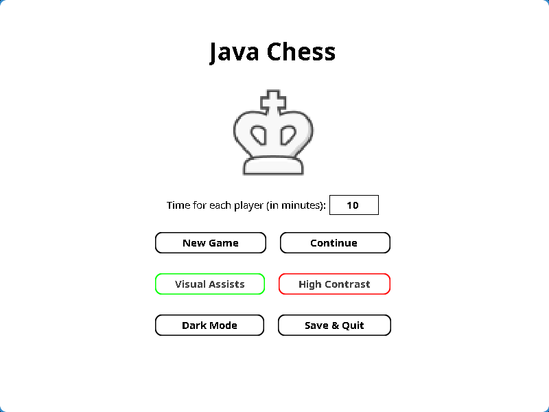
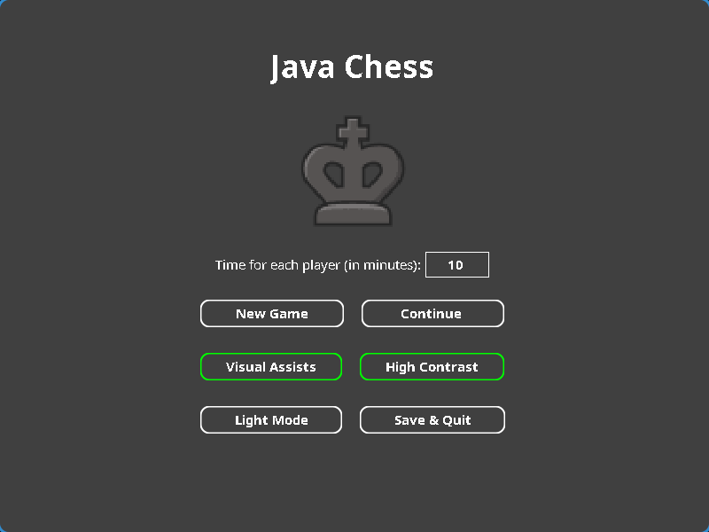
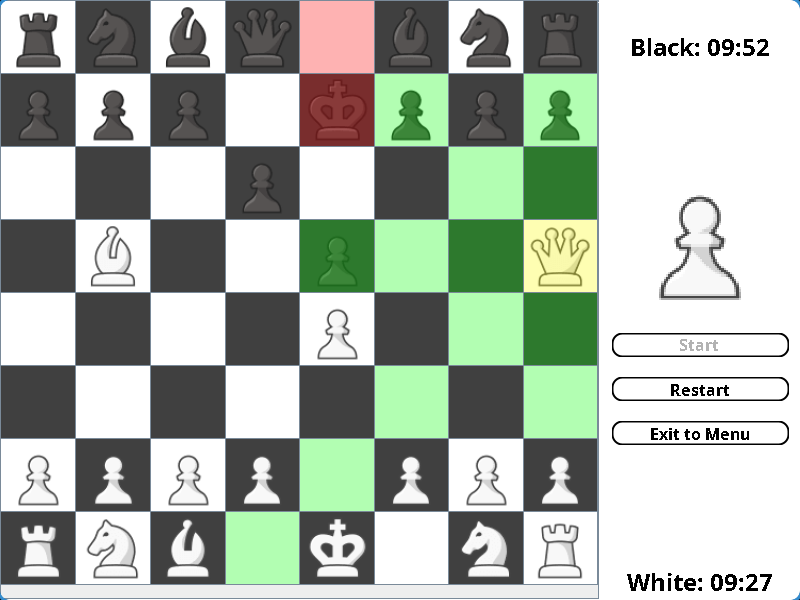
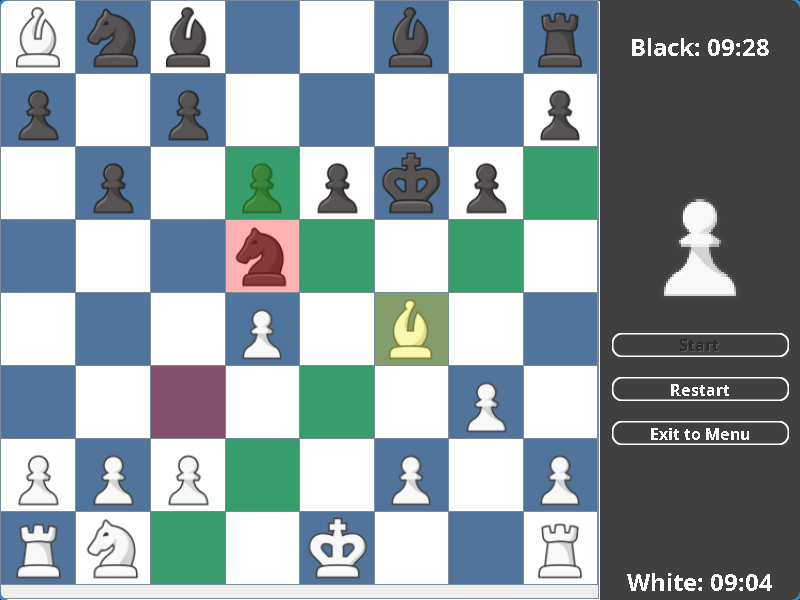

# JavaChess

> Desktop chess application built in Java with focus on object-oriented design and game state validation.

Chess implementation featuring move validation, check/checkmate detection, customizable timers and persistent user preferences - developed with Java Swing/AWT and documented with JavaDoc.

## Screenshots

| Light Mode | Dark Mode |
|---|---|
|  |  |
|  |  |

## Features

### Game Logic
- Move validation - only legal moves are accepted
- Check and checkmate detection
- Pawn promotion with piece selection overlay
- Customizable per-player timers

### Interface
- Interactive chessboard - click to select and move pieces with visual feedback
- Visual assists - highlight possible moves and last move played
- High contrast chessboard option
- Light and dark mode across the entire app
- Responsive desktop window - board and interface scale dynamically

### Engineering
- Object-oriented architecture with encapsulated game rules and state
- Local persistence - user preferences and last game state saved automatically
- Source code documented with JavaDoc

## Getting Started

#### Prerequisites

Java Development Kit (JDK 23+). Check your version with:

```sh
java -version
```

#### Run

Execute the prebuilt `.jar` file available in the repository:

```sh
java -jar JavaChess.jar
```

## License

Licensed under GPL v3.0 - see [`LICENSE`](./LICENSE) for details.
